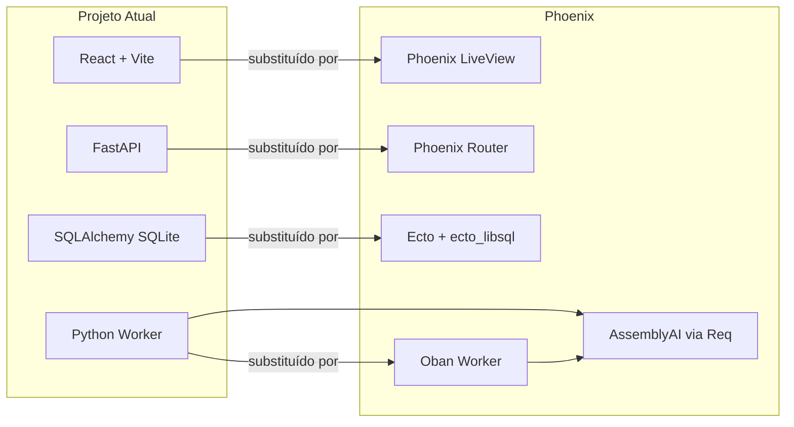
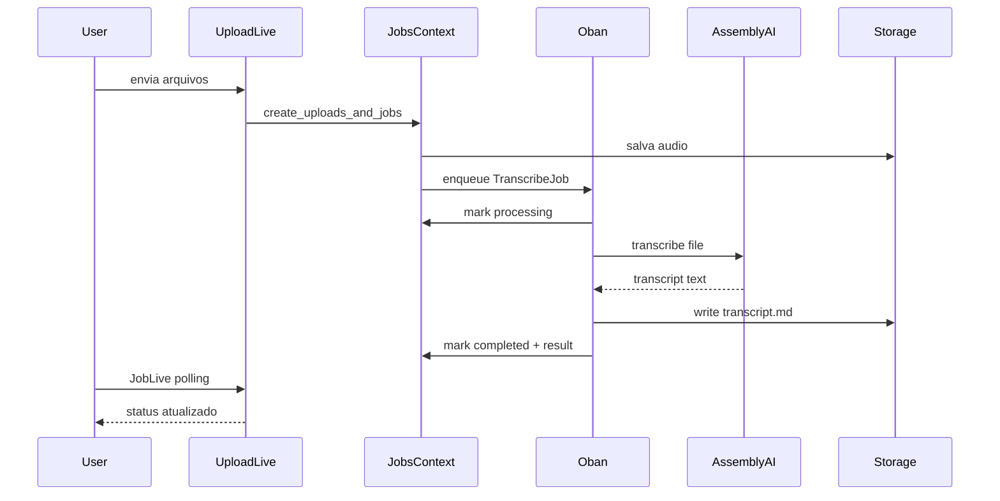

> Criar o projeto `mass-transcriptor-phoenix` em pasta irmã, reescrevendo backend e UI em Phoenix LiveView + Turso (ecto_libsql) com TDD, preservando o layout atual via cópia do `styles.css` e mesmas classes HTML. Whisper fica fora do escopo da v1.

# Migração Mass Transcriptor → Phoenix + Turso (LiveView)

> **For agentic workers:** REQUIRED SUB-SKILL: Use superpowers:subagent-driven-development (recommended) or superpowers:executing-plans to implement this plan task-by-task. Steps use checkbox (`- [ ]`) syntax for tracking.

**Goal:** Reescrever o Mass Transcriptor em Elixir/Phoenix LiveView com Turso, em pasta separada, mantendo o mesmo layout visual e paridade funcional (exceto Whisper local na v1).

**Architecture:** Monólito Phoenix 1.7+ com contexts (`Accounts`, `Jobs`, `Transcription`), Ecto + `ecto_libsql` apontando para Turso (libSQL local em dev, remoto em prod), fila assíncrona com Oban, e UI 100% LiveView reutilizando o design system existente em [`frontend/src/styles.css`](frontend/src/styles.css). Auth por sessão Phoenix (substitui JWT/localStorage do React).

**Tech Stack:** Elixir ~1.17, Phoenix ~1.7, Phoenix LiveView, Ecto, `ecto_libsql`, Oban, Req (HTTP AssemblyAI), Bcrypt, Gettext (en + pt-BR), ExUnit + LiveViewTest.

---

## Localização e isolamento

Criar pasta irmã (projeto original intacto):

```
/Users/matheuspuppe/Desktop/Projetos/
├── mass-transcriptor/          # atual (FastAPI + React) — não alterar
└── mass-transcriptor-phoenix/  # novo (Phoenix + LiveView + Turso)
```

Opcional: worktree git em `.worktrees/phoenix-migration` se quiser branch isolada no mesmo repo. Recomendação: **repo/pasta separada** para stacks totalmente diferentes.

---

## Mapa de equivalência



| Atual (Python/React) | Novo (Phoenix) |
|---|---|
| [`backend/app/models.py`](backend/app/models.py) | Schemas Ecto em `lib/mass_transcriptor/accounts/` e `lib/mass_transcriptor/jobs/` |
| [`backend/app/api/routes.py`](backend/app/api/routes.py) | `router.ex` + LiveViews |
| [`backend/app/worker.py`](backend/app/worker.py) | `MassTranscriptor.Workers.TranscribeJob` (Oban) |
| [`frontend/src/styles.css`](frontend/src/styles.css) | `priv/static/assets/css/app.css` (cópia fiel) |
| [`frontend/src/components/*.tsx`](frontend/src/components/) | Function components HEEx em `lib/mass_transcriptor_web/components/` |
| [`frontend/src/i18n.ts`](frontend/src/i18n.ts) | Gettext `.po` em `priv/gettext/{en,pt_BR}/` |
| JWT + localStorage | `UserToken` + sessão (`:user_id`, `:tenant_slug`) |
| Polling 2s (React `useEffect`) | `handle_info(:poll, socket)` em Job/Batch LiveViews |

---

## Estrutura alvo do novo projeto

```
mass-transcriptor-phoenix/
├── mix.exs
├── config/
│   ├── config.exs          # Oban, Gettext, storage_root
│   ├── dev.exs             # libSQL local (arquivo)
│   ├── test.exs            # DB em memória/tmp
│   └── runtime.exs         # TURSO_DATABASE_URL, ASSEMBLYAI_API_KEY
├── lib/
│   ├── mass_transcriptor/
│   │   ├── repo.ex
│   │   ├── accounts/       # User, Tenant, Membership
│   │   ├── jobs/           # Upload, JobBatch, TranscriptionJob, Result
│   │   ├── storage/        # paths tenant-scoped (espelha backend/app/services/storage.py)
│   │   └── transcription/
│   │       ├── assembly_ai.ex
│   │       └── provider.ex  # behaviour; whisper stub desabilitado
│   └── mass_transcriptor_web/
│       ├── router.ex
│       ├── components/
│       │   ├── layouts.ex       # auth_shell + app_shell
│       │   ├── core_components.ex
│       │   └── ui/              # status_badge, jobs_table, transcript_preview
│       ├── live/
│       │   ├── auth_live/       # SignIn, SignUp
│       │   ├── upload_live.ex
│       │   ├── jobs_live.ex
│       │   ├── job_live.ex
│       │   ├── batch_live.ex
│       │   └── settings_live.ex
│       └── plugs/
│           ├── require_auth.ex
│           └── require_tenant.ex
├── priv/
│   ├── repo/migrations/
│   └── static/assets/css/app.css
├── storage/                # mesmo padrão: storage/<tenant>/uploads/<id>/
└── test/
    ├── support/
    ├── mass_transcriptor/  # context tests
    └── mass_transcriptor_web/live/  # LiveView tests
```

---

## Schema Turso (paridade com migrations atuais)

Espelhar tabelas de [`backend/alembic/versions/`](backend/alembic/versions/):

- `tenants` — slug, name, default_provider (default `"assemblyai"`)
- `users` — name, email, password_hash
- `tenant_memberships` — tenant_id, user_id, role
- `tenant_provider_settings` — provider_key, enabled, config_json
- `uploads` — original_filename, mime_type, size_bytes, audio_path
- `job_batches` — tenant_id
- `transcription_jobs` — status, provider_key, batch_id, error_message, timestamps
- `transcription_results` — markdown_path, transcript_text, provider_metadata_json

**Turso setup:**
- Dev: `database: "file:./dev.db"` via ecto_libsql
- Test: `file::memory:?cache=shared` ou tmp por suite
- Prod: `TURSO_DATABASE_URL` + `TURSO_AUTH_TOKEN` em `runtime.exs`

---

## Rotas LiveView (mesmo layout de navegação)

Espelhar [`frontend/src/App.tsx`](frontend/src/App.tsx):

| Rota | LiveView | Layout |
|------|----------|--------|
| `/` | redirect → `/signin` | — |
| `/signup` | `AuthLive.SignUp` | `auth_shell` |
| `/signin` | `AuthLive.SignIn` | `auth_shell` |
| `/t/:tenant_slug/uploads` | `UploadLive` | `app_shell` |
| `/t/:tenant_slug/jobs` | `JobsLive` | `app_shell` |
| `/t/:tenant_slug/jobs/:id` | `JobLive` | `app_shell` |
| `/t/:tenant_slug/batches/:id` | `BatchLive` | `app_shell` |
| `/t/:tenant_slug/settings` | `SettingsLive` | `app_shell` |

Download de markdown: controller `JobController.download/2` (stream arquivo autenticado), mesma UX do botão atual.

---

## Estratégia de layout (preservar visual)

1. **Copiar** [`frontend/src/styles.css`](frontend/src/styles.css) → `priv/static/assets/css/app.css` sem renomear classes.
2. **Layouts HEEx** replicam estrutura de:
   - [`AuthShell.tsx`](frontend/src/components/AuthShell.tsx) → `layouts.auth/1`
   - [`ProtectedLayout.tsx`](frontend/src/components/ProtectedLayout.tsx) → `layouts.app/1`
3. **Fontes** (Fraunces + Outfit): manter links do [`frontend/index.html`](frontend/index.html) no `root.html.heex`.
4. **Tema dark/light**: hook JS mínimo `ThemeHook` lendo/escrevendo `data-theme` em `<html>` (espelha [`frontend/src/lib/theme.ts`](frontend/src/lib/theme.ts)).
5. **Componentes UI**: mesmas classes BEM (`.upload-dropzone`, `.jobs-table`, `.status-queued`, etc.) dos componentes React atuais.

Critério de aceite visual: screenshots lado a lado (auth, uploads, jobs, job detail, settings) com diferença apenas em detalhes de framework (sem mudança de paleta, tipografia ou grid).

---

## TDD — regras e ordem de implementação

**Iron Law:** nenhum código de produção sem teste falhando antes.

**Ferramentas:**
- `mix test` — contexts, providers, storage
- `Phoenix.LiveViewTest` — formulários, navegação, estados vazios, polling
- `mix credo --strict` + `mix format` no CI

**Ciclo por feature (Red → Green → Refactor → commit):**
1. Escrever teste que descreve comportamento (não implementação)
2. Rodar e confirmar falha pelo motivo certo
3. Implementar mínimo para passar
4. Refatorar mantendo verde
5. Commit atômico

---

## Fases de implementação (TDD)

### Fase 0 — Scaffold e fundação

- [ ] `mix phx.new mass_transcriptor --live` na pasta irmã
- [ ] Adicionar deps: `ecto_libsql`, `oban`, `req`, `bcrypt_elixir`
- [ ] Configurar Repo Turso (dev/test/prod)
- [ ] Teste: `Repo.query!("SELECT 1")` passa em test env
- [ ] Copiar `styles.css` e favicons de `frontend/public/`
- [ ] `root.html.heex` com fontes + `app.css`

### Fase 1 — Accounts + Auth LiveView

**Testes primeiro** (baseados em [`backend/tests/test_auth_api.py`](backend/tests/test_auth_api.py) e [`frontend/src/tests/AuthFlow.test.tsx`](frontend/src/tests/AuthFlow.test.tsx)):

- [ ] `test/.../accounts_test.exs`: signup cria tenant+user+membership owner; slug normalizado; email duplicado → erro
- [ ] `test/.../auth_live_test.exs`: sign up redireciona para `/t/:slug/uploads`; sign in com credenciais inválidas mostra erro; sign out limpa sessão
- [ ] Implementar schemas + migrations + `Accounts.register_user/1`, `Accounts.authenticate/2`
- [ ] LiveViews SignIn/SignUp com `auth_shell` layout
- [ ] Plug `RequireAuth` + redirect para `/signin`

### Fase 2 — Multi-tenancy

**Testes** (de [`backend/tests/test_tenancy.py`](backend/tests/test_tenancy.py)):

- [ ] Usuário sem membership não acessa tenant alheio (403/redirect)
- [ ] `RequireTenant` resolve `tenant_slug` da URL e valida membership
- [ ] Sidebar mostra slug correto e links ativos

### Fase 3 — Upload + criação de jobs

**Testes** (de [`backend/tests/test_upload_api.py`](backend/tests/test_upload_api.py), [`frontend/src/tests/UploadPage.test.tsx`](frontend/src/tests/UploadPage.test.tsx)):

- [ ] Upload único → 1 job `queued` provider `assemblyai`
- [ ] Upload múltiplo (2+) → `JobBatch` compartilhado
- [ ] Arquivo salvo em `storage/<tenant>/uploads/<id>/audio/`
- [ ] LiveView: dropzone, lista de arquivos, remover, "clean all", submit

### Fase 4 — Oban + AssemblyAI

**Testes** (de [`backend/tests/test_job_worker.py`](backend/tests/test_job_worker.py), [`backend/tests/test_assemblyai_account.py`](backend/tests/test_assemblyai_account.py)):

- [ ] Mock Req: job `queued` → `processing` → `completed` com markdown em disco
- [ ] Falha API → status `failed` + `error_message`
- [ ] Worker idempotente (não reprocessa `completed`)
- [ ] Implementar `Transcription.AssemblyAI.transcribe/2` e `Workers.TranscribeJob`
- [ ] Oban config: queue `:transcription`, `max_attempts: 3`

**Fora do escopo v1:** Whisper — manter provider desabilitado na UI/settings com mensagem "coming soon".

### Fase 5 — Jobs list + detail + batch

**Testes** (de [`frontend/src/tests/JobsPage.test.tsx`](frontend/src/tests/JobsPage.test.tsx), [`JobDetailPage.test.tsx`](frontend/src/tests/JobDetailPage.test.tsx), [`JobBatchPage.test.tsx`](frontend/src/tests/JobBatchPage.test.tsx), [`jobGroups.test.ts`](frontend/src/tests/jobGroups.test.ts)):

- [ ] Lista agrupa jobs por `batch_id` (mesma lógica de [`frontend/src/lib/jobGroups.ts`](frontend/src/lib/jobGroups.ts))
- [ ] `JobLive`: polling auto quando status `queued`/`processing`; para ao `completed`/`failed`
- [ ] Retry em job `failed` → volta para `queued` e enfileira Oban
- [ ] Download markdown autenticado
- [ ] `TranscriptPreview`: copy-to-clipboard via hook JS
- [ ] `BatchLive`: tabs por arquivo no batch

### Fase 6 — Settings

**Testes** (de [`backend/tests/test_provider_settings_api.py`](backend/tests/test_provider_settings_api.py), [`frontend/src/tests/SettingsPage.test.tsx`](frontend/src/tests/SettingsPage.test.tsx)):

- [ ] GET settings: workspace_name, default_provider, assemblyai enabled
- [ ] PATCH: atualiza nome do tenant; valida API key AssemblyAI (mock Req)
- [ ] Exibe créditos AssemblyAI quando key configurada
- [ ] Layout settings em duas colunas (intro + form), igual [`SettingsPage.tsx`](frontend/src/pages/SettingsPage.tsx)

### Fase 7 — i18n + tema

**Testes** (de [`frontend/src/tests/theme.test.tsx`](frontend/src/tests/theme.test.tsx)):

- [ ] Gettext en + pt_BR com chaves equivalentes a [`frontend/src/i18n.ts`](frontend/src/i18n.ts)
- [ ] Seletor de idioma na sidebar persiste em sessão/cookie
- [ ] Theme toggle alterna `data-theme` e persiste em localStorage

### Fase 8 — CI e polish

- [ ] `.github/workflows/ci.yml`: `mix deps.get`, `mix test`, `mix credo`, `mix format --check`
- [ ] `.env.example` com `TURSO_*`, `ASSEMBLYAI_API_KEY`, `SECRET_KEY_BASE`
- [ ] `README.md` com setup dev (Turso CLI opcional) e comparação com projeto original

---

## Fluxo assíncrono (job lifecycle)



---

## Matriz de paridade com testes existentes

| Teste atual | Teste Phoenix equivalente |
|---|---|
| `test_auth_api.py` | `accounts_test.exs` |
| `test_upload_api.py` | `jobs/upload_test.exs` + `upload_live_test.exs` |
| `test_job_batch_api.py` | `jobs/batch_test.exs` + `batch_live_test.exs` |
| `test_job_worker.py` | `workers/transcribe_job_test.exs` |
| `test_provider_settings_api.py` | `settings_live_test.exs` |
| `test_storage.py` | `storage_test.exs` |
| `AuthFlow.test.tsx` | `auth_live_test.exs` |
| `UploadPage.test.tsx` | `upload_live_test.exs` |
| `JobDetailPage.test.tsx` | `job_live_test.exs` |
| `jobGroups.test.ts` | `jobs/grouping_test.exs` |

---

## Riscos e mitigações

| Risco | Mitigação |
|---|---|
| Turso libSQL difere de SQLite puro | Usar `ecto_libsql` em todos os ambientes; não misturar adapters |
| Upload grande em LiveView | `allow_upload` com `max_file_size` e validação MIME; chunk se necessário |
| AssemblyAI timeout | Oban retries + status `failed` com mensagem acionável |
| Paridade visual LiveView vs React | Copiar CSS sem alteração; testes LiveView assertam classes-chave no HTML |
| Whisper ausente na v1 | Default provider `assemblyai`; UI não oferece Whisper até fase futura |

---

## Entregáveis finais

1. App Phoenix funcional em `mass-transcriptor-phoenix/`
2. Mesmo layout (auth shell, sidebar, páginas, tokens CSS)
3. Turso configurado (local + remoto)
4. AssemblyAI como único provider ativo
5. Suite ExUnit cobrindo fluxos críticos (paridade com 22 arquivos de teste atuais)
6. Projeto original [`mass-transcriptor/`](.) permanece intacto como referência

## Todos

- [ ] **scaffold** — Fase 0: Criar mass-transcriptor-phoenix com Phoenix, ecto_libsql, Oban, copiar styles.css
- [ ] **auth** — Fase 1-2: Accounts, migrations Turso, auth LiveView, multi-tenancy (TDD)
- [ ] **uploads** — Fase 3: Upload LiveView + Jobs context + storage local (TDD)
- [ ] **transcription** — Fase 4: Oban worker + AssemblyAI provider (TDD, sem Whisper)
- [ ] **jobs-ui** — Fase 5: Jobs list/detail/batch LiveViews com polling e retry (TDD)
- [ ] **settings-i18n** — Fase 6-7: Settings, Gettext en/pt-BR, theme hook (TDD)
- [ ] **ci** — Fase 8: CI GitHub Actions, README, .env.example
